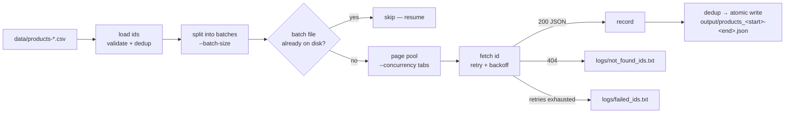

<div align="center">

# tiki-scraper

**Bulk-fetches Tiki product-detail JSON for hundreds of thousands of product ids —
resumable, WAF-aware, and boring to operate.**


</div>

---

Reads product ids from `data/products-*.csv` and stores the **full** product-detail
response — every field the API returns, with `id` normalized to an integer — as
batched JSON files in `output/`.

Requests go through [CloakBrowser](https://pypi.org/project/cloakbrowser/) (a stealth
Chromium) rather than a plain HTTP client, because Tiki's WAF serves a JavaScript
challenge page instead of JSON to non-browser clients. Pages are long-lived and
reused across ids, so the cookie earned by solving the challenge keeps working.

## How it works



Each batch writes its file only after its not-found and failed ids are logged, so a
crash mid-batch re-fetches that batch instead of silently marking it done.

## Setup

```bash
git lfs pull    # data/products-*.csv are stored in Git LFS
uv sync
```

## Run

```bash
uv run tiki-scraper
```

```
2026-07-18 11:20:44 INFO input ids: total_read=600000 invalid=0 duplicate=0 valid=600000
2026-07-18 11:21:22 INFO batch 241400-241599: 141 ok, 59 not_found, 0 failed (0 blocked) at concurrency=6
2026-07-18 11:21:53 INFO batch 241600-241799: 143 ok, 57 not_found, 0 failed (0 blocked) at concurrency=6
...
2026-07-19 09:51:27 INFO pipeline done: batches_total=824 batches_skipped=0 fetched=98719 not_found=65953 failed=1 blocked=0
2026-07-19 09:51:32 INFO verification: 98719 total output records, no duplicates
```

Options (`uv run tiki-scraper --help`):

| Flag | Default | Meaning |
| --- | --- | --- |
| `--input` | all `data/products-*.csv` | one or more CSVs with an `id` column |
| `--output-dir` | `output/` | where batch JSON files are written |
| `--logs-dir` | `logs/` | where `not_found_ids.txt` / `failed_ids.txt` are written |
| `--batch-size` | `1000` | ids per output file |
| `--concurrency` | `3` | number of persistent browser pages fetching in parallel |
| `--retries` | `3` | retry attempts per request on 5xx/429/timeout/challenge page |
| `--backoff-base` | `2.0` | seconds; exponential backoff base between retries |
| `--proxy` | `$SCRAPER_PROXY` | proxy URL for outbound Tiki requests |

Keep `--concurrency` low. Each unit is a live Chromium tab (~50–80 MB), not a cheap
socket, so the pool size is fixed for the whole run and sized up front.

### Resume

Re-running the same command resumes automatically: any
`output/products_<start>-<end>.json` that exists and parses as a JSON array is
treated as already attempted and is not re-fetched.

- Ids that returned 404 land in `logs/not_found_ids.txt` (the product no longer
  exists — not an error).
- Ids that failed after exhausting retries land in `logs/failed_ids.txt`.

Both log files start with an `id` header, so each is a valid `--input` CSV on its
own. Re-run just the failures with:

```bash
uv run tiki-scraper --input logs/failed_ids.txt --output-dir output2
```

After each run the CLI verifies the output directory and reports the total record
count plus any duplicate ids across files.

## Tests

```bash
uv run pytest
```

## Proxy (optional)

Runs direct by default. If your IP starts getting served challenge pages, set
`SCRAPER_PROXY` (or `--proxy`) to a residential proxy URL —
`scripts/mkproxy.py` builds one from `.env` credentials.

## Layout

```
src/tiki_scraper/
├── cli.py         entrypoint: load ids → run pipeline → verify output
├── config.py      argument parsing → Settings
├── ids.py         CSV loading, id validation and dedup
├── client.py      one request on a browser page: retries, 404 / WAF classification
├── product.py     Tiki URL template + response normalization
└── pipeline.py    page pool, batching, atomic writes, resume

tests/             pytest suite (no network)
data/              product-id CSVs (tracked via Git LFS)
scripts/mkproxy.py builds SCRAPER_PROXY from .env credentials
```
